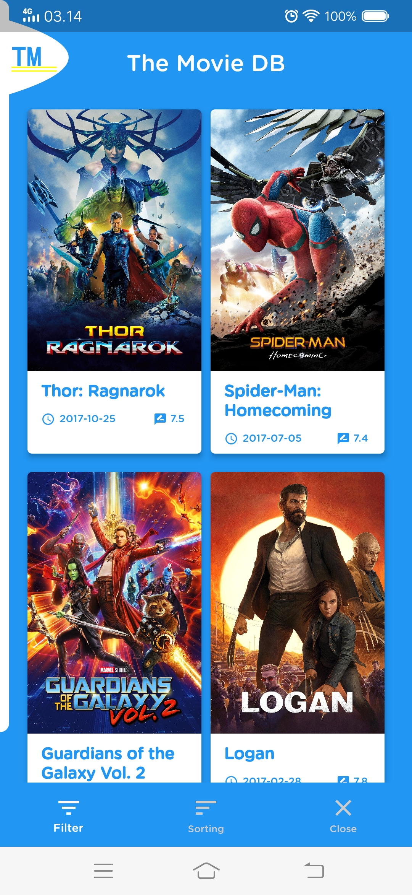
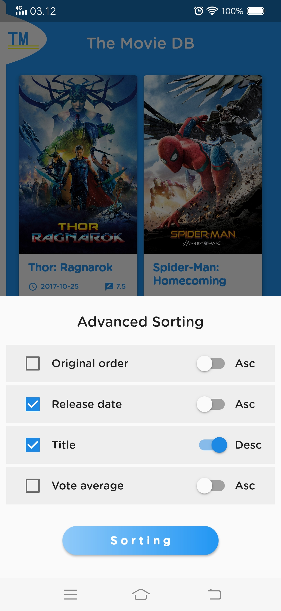
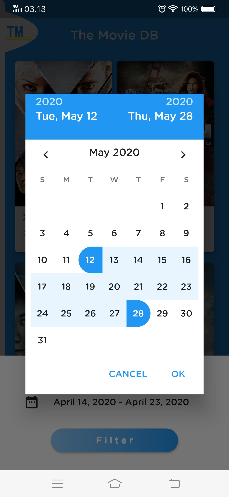
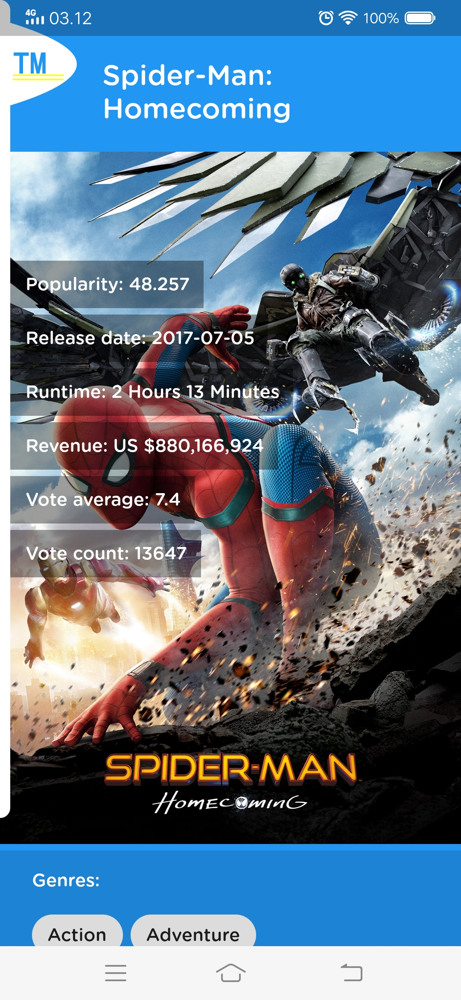
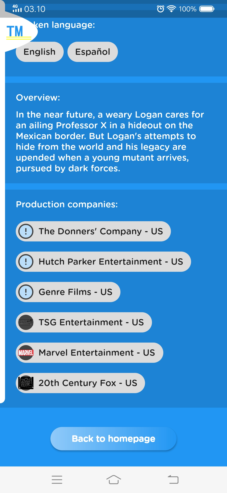

# FLUTTER ENGINEER CHALLENGE

> some screenshots
<p>
 &nbsp; &nbsp; 
</p>

<p>
 &nbsp; &nbsp; 
</p>

<p>
 &nbsp; &nbsp; 
</p>


# cara untuk menjalankan aplikasi
> pastikan sudah menginstal flutter pada komputer ya

``` bash
- git clone this repo
- masuk ke dalam folder projek

$ flutter pub get
$ flutter run
```